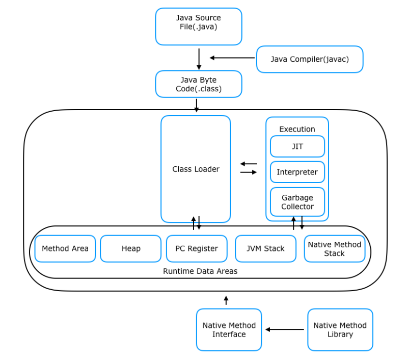

# [1WEEK] JAVA 기본

## COW SPRING 3기 PRE-ONBOARDING 학습 과제

본격적으로 Spring 학습에 들어가기 전에 여러분은 객체지향 코드에 대해 학습하고 이해하는 시간을 가지실겁니다!

객체지향 코드를 짜기 위해서는 우리가 사용할 언어인 JAVA에 대해 이해하고 있어야합니다. 

이 온보딩 과제는 이번 COW L2 - Spring에 함께 하시는 9분의 개개인의 역량이 다르기 때문에 가장 최소한으로 알고 계셔야 할 내용을 중심으로 선정해봤어요!

많은 양의 정리를 요구하지 않는 과제이니 이해하신 내용을 토대로 간단하게 정리해주시면 됩니다. (1, 2기의 학습자료가 github에 나와있으니 참고하셔도 좋아요☺️)

개인적으로, 분명 학습했던걸 다 기억하실 수 없으실거예요! 저도 마찬가지이고요.. 공부했던 것을 잘 정리해두는 습관을 가지는 것은 분명 큰 도움으로 돌아올 것이라 생각합니다. 그런 의미로 다들 파이팅해봐요!

---
> 아래의 필수 질문은 모든 분들이 정리하고 학습하셔야하는 내용입니다. 선택 질문은 원하시는 분들만 하시면 되지만 분명 학습하시면 큰 도움이 될 것들을 추려봤습니다! 

# 필수

## 자바 역사와 버전별 특징

---
### JDK 1.0	(1996년 1월 23일)
- 최초로 출시된 Java

### JDK 1.1	(1997년 2월 2일)
- AWT 이벤트 재정비
- 내부 클래스 추가
- JDBC 추가
- RMI 및 직렬화
- Taligent에서 시작된 국제화 및 유니코드 지원

### J2SE 1.2 (1998년 12월 4일)
- strictfp 키워드 추가
  -  strictfp를 사용하면 플랫폼과 상관없이 독립적인 부동 소수점 계산 보장 가능
- Swing 그래픽 API가 핵심 클래스에 통합
- Sun의 JVM에 처음으로 JIT 컴파일러 탑재
- 자바 플러그인 추가
- CORBA 상호 운용성을 위한 IDL 구현체인 Java IDL
- 컬렉션 프레임워크

### J2SE 1.3 (2000년 5월 8일)
- HotSpot JVM 포함
  - Java 코드 실행 시에 바이트 코드를 기계어로 번역하는 작업 때문에 성능이 느림, 
  이러한 문제를 해결하고자 바이트 코드를 기계어로 컴파일하는 JIT 컴파일러를 도입하여 사용 (HotSpot JVM에는 2개의 JIT 컴파일러 존재)
    - c1 : 클라이언트 컴파일러, 코드 최적화는 덜하지만 즉시 시작되는 속도는 빠름
    - c2 : 서버 컴파일러, 즉시 시작되는 속도는 느리지만 최적화는 많이 되어 나중에는 빠름
- 코어 라이브러리에 포함된 JNDI
  - JNDI(Java Naming and Directory Interface)
    - 데이터베이스 연결 시에 데이터베이스 커넥션을 미리 만들어서 저장하기 위한 용도
- 자바사운드 추가

### J2SE 1.4 (2002년 2월 13일)
- assert 키워드 추가
  - Assert : 대부분의 언어에 존재하는 코드가 올바르게 동작하는지 확인하는 용도
- 인터넷 프로토콜 버전 6(IPv6) 지원
- 로깅 API 추가
- 이미지를 읽고 쓰기 위한 이미지 I/O API 추가
- 통합 보안 및 암호화 확장(JCE, JSSE, JAAS)
- Java Web Start 추가
- 기본 설정 API 추가

### Java SE 5 (2004년 9월 29일)
- 언어 기능 추가
  - Generic : 컬렉션에 대한 컴파일 타임(정적) 자료형 안전성을 제공하고 대부분의 자료형 변환에 대한 필요성을 제거
  - Meta Data : 주석(annotation)이라고도 하며. 클래스 및 메서드와 같은 언어 구조에 추가 데이터로 태그를 지정 가능
  - Autoboxing/unboxing: 기본 유형(예: int)과 기본 래퍼 클래스(예: Integer) 간의 자동 변환 가능
  - 열거형: enum 키워드는 형식이 안전하고 정렬된 값 목록으로 이전에는 유형이 안전하지 않았음
  - Varargs: 메소드의 마지막 매개변수는 이제 유형 이름 뒤에 세 개의 점을 사용하여 선언 가능하며, 호출 코드에서 해당 유형의 매개 변수를 얼마든지 사용할 수 있고,
    그런 다음 메서드에 전달할 배열에 배치하거나 호출 코드가 해당 유형의 배열을 전달할 수 있음 EX_) void drawtext(String... lines))
  - 각 루프에 대해 향상됨: for 루프 구문은 특수 구문으로 확장
  - 다중 스레드 Java 프로그램의 실행 시맨틱이 향상되어, 새로운 Java 메모리 모델은 이전 사양의 복잡성, 효율성 및 성능 문제를 해결
  - 정적 임포트
- 표준 라이브러리
  - RMI 객체에 대한 자동 스텁 생성
  - Swing 추가
  - 동시성 유틸리티 추가
  - Scanner 클래스 추가

### Java SE 6 (2006년 12월 11일)
- 스크립팅 언어 지원 : 스크립팅 언어 및 기본 제공 Mozilla JavaScript Rhino 통합과의 긴밀한 통합을 위한 일반 API
- 핵심 플랫폼 및 Swing의 극적인 성능 향상
- JDBC 4.0 지원
- Java 컴파일러 API 추가
- 플러그형 주석 지원
- API에 SwingWorker 통합하여 GUI 개선

### Java SE 7 (2011년 7월 28일)
- 새로운 바이트코드를 사용하여 동적 언어에 대한 JVM 지원
- 언어 변경 사항
  - switch 내 문자열 수정
  - try-with-resources 문이라고도 하는 try-statement의 자동 리소스 관리
  - 일반 인스턴스 생성을 위한 향상된 유형 추론(다이아몬드 연산자 <>)
  - 간소화된 varargs 메서드 선언
  - 이진 정수 리터럴
  - 숫자 리터럴에서 밑줄 허용
- 동시성 유틸리티 확장
- Timsort 추가 : Timesort는 병합 정렬 대신 객체의 컬렉션 및 배열을 정렬하는 데 사용
- 타원 곡선 암호화 알고리즘에 대한 라이브러리 지원
- XML 및 유니코드에 대한 업스트림 업데이트
- Java 배포 규칙 세트 추가

### Java SE 8 (LTS)	(2014년 3월 18일)
- 람다 식을 지원하여 컬렉션에 대한 MapReduce에서 영감을 받은 변환과 같은 요소 스트림에 대한 기능 스타일 작업도 가능
- API 작성자는 기본 메서드를 사용하여 이전 코드를 손상시키지 않고 인터페이스에 새 메서드를 추가 가능
- Java 구문에서 주석 가능한 위치 집합을 확장하여 유형의 사용과 유형 선언을 나타내는 이름을 추가
- 단일 프로그램 요소에 동일한 유형의 주석을 여러 개 적용할 수 있도록 수정
- 날짜 및 시간 API 추가

### Java SE 9 (2017년 9월 21일)
- 다른 애플리케이션이 이 기능을 활용할 수 있도록 API와 함께 Java 프로그래밍 언어의 선언, 명령문 및 표현을 평가하는 대화형 도구를 제공
- HiDPI 그래픽을 구현 가능
    - 컴퓨터 디스플레이의 몇 배 더 많아진 픽셀 수만큼 몇 배로 더 픽셀을 사용하여 선명하게 보여주는 표시 방식 (= Display Scaling(화면 배율))

### Java SE 10	(2018년 3월 20일)
- 로컬 변수 유형 유추
  - 지역 변수 선언에 대한 유형 추론을 확장하도록 Java 언어를 강화
- JDK 포리스트를 단일 리포지토리로 통합
  - 개발을 단순화하고 간소화하기 위해 수많은 리포지토리를 단일 리포지토리로 결합
- 가비지 컬렉터 인터페이스
- G1용 병렬 전체 GC
- 애플리케이션 클래스 데이터 공유
- 스레드 로컬 핸드셰이크
  - 모든 스레드를 중지하거나 전혀 중지하지 않고 개별 스레드를 중지하는 것이 가능하고 저렴하도록 만듦
- 추가 유니코드 언어 태그 확장
- 대체 메모리 장치의 힙 할당
- 시간 기반 릴리스 버전 관리
  - 현재 및 미래의 시간 기반 릴리스 모델에 대해 Java SE 플랫폼 및 JDK의 버전 문자열 체계와 관련 버전 정보를 수정

### Java SE 11 (LTS) (2018년 9월 25일)
- 중첩 기반 액세스 제어
  - 중첩을 사용하면 논리적으로 동일한 코드 엔터티의 일부이지만 별도의 클래스 파일로 컴파일되는 클래스가 컴파일러에서 따로 메서드를 삽입할 필요 없이 
    서로의 전용 멤버에 액세스 가능
- 동적 클래스 파일 상수
- 무작동 가비지 컬렉터 추가
- HTTP 클라이언트 API 표준화함
- Lambda 매개변수에 대한 로컬 변수 구문
  - var로 형식화된 람다 식의 형식 매개 변수를 선언할 때 사용할 수 있음
- 유니코드 10 추가
- ChaCha20 및 Poly1305 암호화 알고리즘
  - 이전의 안전하지 않은 RC4 스트림 암호를 대체할 수 있는 비교적 새로운 스트림 암호0ChaCha20 및 ChaCha20-Poly1305로 암호를 구현
- 단일 파일 소스 코드 프로그램 실행
  - 스크립트 내에서의 사용을 포함하여 Java 소스 코드의 단일 파일로 제공되는 프로그램을 실행하도록 실행 프로그램을 향상

### Java SE 12 (2019년 3월 19일)
- 마이크로벤치마크 제품군
    - DK 소스 코드에 기본 마이크로벤치마크 제품군을 추가하면 개발자가 기존 마이크로벤치마크를 쉽게 실행하고 새 마이크로벤치마크를 생성 가능
- JVM 상수 API
  - 주요 클래스 파일 및 런타임 아티팩트로 특히 상수 풀에서 로드할 수 있는 상수에 대한 명목 설명을 모델링하는 API

### Java SE 13 (2019년 9월 17일)
- 동적 CDS 아카이브
  -  실행이 끝날 때 클래스를 동적으로 보관할 수 있도록 애플리케이션 클래스-데이터 공유를 확장
- ZGC: 사용되지 않은 메모리 커밋 해제
  - 사용되지 않은 힙 메모리를 운영 체제에 반환하도록 ZGC를 향상

### Java SE 14 (2020년 3월 17일)
- 패키징 도구 추가
- JFR 이벤트 스트리밍
  - 지속적인 모니터링을 위해 JDK Flight Recorder 데이터를 노출
- NullPointerExceptions 유용성 확장
- 스위치 식 표준화
- Java 힙 외부의 외부 메모리에 안전하고 효율적으로 액세스할 수 있도록 API를 도입

### Java SE 15 (2020년 9월 16일)
- dDSA(Edwards-Curve 디지털 서명 알고리즘)을 통해 암호화 서명을 구현
- Hidden 클래스
  -  Hidden 클래스는 런타임에 클래스를 생성하고 리플렉션을 통해 간접적으로 사용하는 프레임워크에서 사용하기 위해 추가
- 텍스트 블록 추가
  - 텍스트 블록은 대부분의 이스케이프 시퀀스가 필요하지 않고 예측 가능한 방식으로 문자열 형식을 자동으로 지정하며 개발자가 원하는 경우 형식을 제어할 수 있는 여러 줄 문자열 리터럴

### Java SE 16 (2021년 3월 16일)
- 벡터 API 추가
  - 최적의 벡터 하드웨어 명령으로 안정적으로 컴파일하는 벡터 계산을 표현함으로써 동등한 스칼라 계산보다 뛰어난 성능을 달성
- GitHub로 마이그레이션
  - 모든 단일 저장소 OpenJDK 프로젝트를 GitHub로 마이그레이션
- 외부 링커 API 추가
    - 오류가 발생하기 쉬운 네이티브 라이브러리 바인딩 프로세스를 상당히 단순화
- 값 기반 클래스에 대한 경고
  -  값 기반 클래스 인스턴스에 대한 부적절한 동기화 시도에 대해 경고를 제공
- 패키지 도구 추가
  - Java 애플리케이션을 패키징하기 위한 도구를 제공
- instanceof에 대한 패턴 일치화
  - 객체에서 구성 요소를 조건부로 추출하는 기능을 보다 간결하고 안전하게 표현
- Record를 통한 Java 프로그래밍 언어를 강화

### Java SE 17 (LTS) (2021년 9월 14일)
- 향상된 의사 난수 생성기
    - PRNG 알고리즘을 포함하여 PRNG(의사 난수 생성기)에 대한 새로운 인터페이스 유형 및 구현을 제공
        - PRNG : 난수를 흉내내기 위한 알고리즘으로 생성되는 값 (알고리즘이 존재하기 때문에 난수의 예측 불가능성을 가질 수 없음)
- Sealed 클래스 추가
    - Sealed 클래스 및 인터페이스는 이를 확장하거나 구현할 수 있는 다른 클래스 또는 인터페이스를 제한함
- 외부 함수 및 메모리 API
    - 외부의 코드 및 데이터와 상호 운용할 수 있는 API를 도입
- JEP 415: 컨텍스트별 역직렬화 필터
    - 상황별 동적으로 선택된 역직렬화 필터를 구성
        - 직렬화 : 객체들의 데이터를 연속적인 데이터로 변형하여 전송 가능한 형태로 만드는 것
        - 역직렬화 : 직렬화된 데이터를 다시 객체의 형태로 만드는 것
- JDK 내부를 강력하게 캡슐화하여 JDK의 보안 및 유지 관리성을 개선

### Java SE 18 (2022년 3월 22일)
- 기본적으로 UTF-8 사용
- 단순 웹 서버를 구현할 수 있는 API 추가
- 메소드 핸들로 코어 리플렉션 재구현
    - 기본 메커니즘을 처리하는 메서드를 만들면 API 와 API 모두의 유지 관리 및 개발 비용이 절감
- 인터넷 주소 확인 SPI 정의
    - 내장된 확인자 이외의 확인자를 사용할 수 있도록 호스트 이름 및 주소 확인을 위한 서비스 제공자 인터페이스(SPI)를 정의

### Java SE 19 (2022년 9월 20일)
- 구조화된 동시성을 위한 API를 도입하여 멀티스레드 프로그래밍을 단순화
  - 서로 다른 스레드에서 실행되는 여러 작업을 단일 작업 단위로 처리하여 오류 처리 및 취소가 간소화되고 안정성이 향상되며 관찰 가능성이 향상

### Java SE 20 (2023년 3월 21일)
- 범위 값 정의
  - 쓰레드 내에서 그리고 스레드 간에 불변 데이터를 공유할 수 있는 범위 값을 도입
  - 많은 수의 가상 스레드를 사용할 때 스레드 로컬 변수보다 선호

### Java SE 21 (LTS) (2023년 9월 19일)
- 정의된 만남 순서로 컬렉션을 나타내는 새로운 인터페이스를 도입
- 레코드 패턴과 유형 패턴을 중첩하여 강력하고 선언적이며 구성 가능한 형태의 데이터 탐색 및 처리를 활성화 EX_) Point -> X & Y
- 처리량이 높아 동시 애플리케이션을 작성, 유지 관리 및 관찰하는 노력을 크게 줄여주는 경량 스레드를 Java 플랫폼에 도입
- 동적 로딩을 허용하지 않도록 함
  - 경고는 기본적으로 무결성을 향상시키기 위해 기본적으로 에이전트의 동적 로드를 허용하지 않는 향후 릴리스에 대해 사용자를 준비시키는 것을 목표
- 키 암호화를 사용하여 대칭 키를 보호하기 위한 암호화 기술인 키 캡슐화 메커니즘용 API 추가

## Primitive Type과 Reference Type의 차이점

---
Primitive Type (원시 타입)
- 정수, 실수, 문자, 논리 리터럴 등의 실제 데이터 값을 저장하는 타입
  - EX_) int, long, double, float, boolean, byte, short, char

Reference Type (참조 타입)
- 객체의 주소를 저장하는 타입으로 메모리 주소 값을 통해 객체를 참조하는 타입
  - EX_) Integer, Long, Double, Float, Boolean, Byte, Short, Char

### 실제 객체 는 힙(heap) 메모리에 저장되며 참조 타입 변수 는 스택 메모리 에 실제 객체들의 주소를 저장하여, 객체를 사용할 때마다 참조 변수에 저장된 객체의 주소를 불러와 사용하는 방식

## JAVA의 접근 제어자

---
접근 제어자 (Access Modifier)
- Public : 외부 클래스가 자유롭게 사용할 수 있음
- Protected : 같은 패키지 또는 자식 클래스에서 사용할 수 있음
- Private : 외부에서 접근할 수 없음
- default : 같은 패키지에 소속된 클래스에서만 사용할 수 있음

## static 키워드

---
Static
- static은 모든 객체가 공유하는 값으로 클래스 이름을 통해서 접근해야 하며, 객체를 생성하지 않고도 사용할 수 있음

## final 키워드

---
Final
- 위치에 따라 의미가 조금씩 다르지만, 공통적으로 Final 키워드를 붙이면 무언가를 제한한다는 의미를 가짐
- Final + 변수
  -  변수에 final을 붙이면 이 변수는 수정할 수 없다는 의미
- Final + 메소드
  - 메서드에 final을 붙이면 override를 제한함
- Final + 클래스
  - final 키워드를 클래스에 붙이면 상속 불가능

## 오버로딩(Overloading)과 오버라이딩(Overriding)

---
Overloading (오버로딩)
- 두 메서드가 같은 이름을 갖고 있으나 인자의 수나 자료형이 다른 경우 
  - public double computeArea(Circle c) { ... }
  - public double computeArea(Circle c1, Circle c2) { ... }
  - public double computeArea(Square c) { ... }

Overriding (오버라이딩)
- 상속 관계에 있는 상위 클래스의 메서드와 같은 함수를 하위 클래스에 재정의하는 것

## 추상 클래스와 인터페이스

---
Abstract Class (추상 클래스)
- 하위 클레스들의 공통점을 모아서 만든 클래스
- 다중 상속이 불가능하며 단일 상속만 가능
- 일반 클래스와 같이 일반적인 필드, 메서드 생성자를 가질 수 있음
- 추상화를 하면서 중복되는 클래스의 멤버들을 통합하는 데에 유용
- 클래스 간의 연관 관계를 구축하는 것이 목적

인터페이스
- 내부의 모든 메소드는 abstract로 정의
- 내부의 모든 필드는 상수
- 클래스에서 다중 구현 지원
- 인터페이스끼리는 다중 상속 지원
- 제어자를 붙여 구체적인 메스드를 구현 가능 EX_) Static, Default, Private
- 상속에 얽매이지 않고, 공통 기능이 필요할 때마다 추상 메서드를 정의하여 자유롭게 붙였다 땟다 사용 가능
- 인터페이스는 구현 객체들이 같은 동작을 한다는 것을 보장하기 위해 사용하는 것이 목적

## JAVA Enum

---
Enum (열거형)
- 멤버라 불리는 명명된 값의 집합을 이루는 자료형 단순히하면 상수 데이터들의 집합
- Enum의 장점
  - 코드가 단순해지며 가독성이 좋아짐
  - 허용 가능한 값들의 제한으로 인해 유형 안전을 제공
  - 구현의 의도가 열거임을 분명하게 나타냄ㄴ
  - Switch문에서도 사용 가능
  - 리팩토링시에 변경 범위가 최소화됨
- Enum 메소드
  - name() : 열거 객체의 문자열을 리턴
  - ordinal() : 열거 객체의 순번(0부터 시작)을 리턴
  - compareTo() : 열거 객체를 비교해서 순번 차이를 리턴 
  - valueOf(String name) : 문자열을 입력받아서 일치하는 열거 객체를 리턴
  - values() : 모든 열거 객체를 배열로 리턴

## 객체 지향

---
객체 지향
- 동사에 따라 정의하는 것이 아닌, 명사에 따라 정의하는 것으로, 명사(객체)들 간의 상호작용을 통해 정의하는 것을 의미
VS 절차 지향
- 절차 지향은 순서에 따라 일을 처리하여 데이터가 많아지면 처리해야할 일의 양이 많아짐
- 객체 지향은 데이터가 많아도 객체의 정의만 잘 내리면 관계로 정의가 가능하여 절차 지향보다 빠름

## 객체지향 4대 특성

---
추상화
- 객체의 공통적인 속성과 기능을 추출하여 정의하는것

캡슐화
- 클래스나 멤버들을 외부에서 접근하지 못하도록 접근을 제한

상속
- 상위 클래스로부터 확장된 여러 개의 하위 클래스들이 모두 상위 클래스의 속성과 기능들을 간편하게 사용

다형성
- 어떤 객체의 속성이나 기능이 그 맥락에 따라 다른 역할을 수행할 수 있는 객체 지향의 특성

## SOLID 원칙

---
### **S**ingle Responsibility Principle (단일 책임의 원칙) - SRP
- 작성된 클래스는 하나의 기능만을 가지며 클래스가 제공하는 모든 서비스는 그 하나의 책임을 수행하는 데 집중되어 있어야 함

### **O**pen Close Principle (개방폐쇄의 원칙) - OCP
- 소프트웨어의 구성요소들은 확장에는 열려있고, 변경에는 닫혀 있어야 함

### **L**iskov Substitution Principle (리스코브 치환의 법칙) - LSP
- 하위 타입의 개체는 언제든 상위 타입과 교체 될 수 있어야 함

### **I**nterface Segregation Principle (인터페이스 분리의 법칙) - ISP
- 자신이 사용하지 않는 인터페이스는 구현하지 말아야 함

### **D**ependency Inversion Principle (의존성역전의 원칙) - DIP
- 하위 타입에서의 변경이 상위 타입에 변경을 요구하면 안됨

# 선택사항 (추가로 공부하면 좋은 것들입니다!)

## Java Annotation

---
Annotaion
- 비즈니스 로직에는 영향을 주지는 않지만 해당 타겟의 연결 방법이나 소스코드의 구조를 변경할 수 있음
- 소스 코드에 메타 데이터를 삽입하는 것으로, 체계적인 소스코드를 구성하는 데에 도움을 줌

## Lambda, Stream

---
Lambda
- 익명 함수(anonymous function)라고도 부르며, 이름이 없는 함수로 일반적으로 함수를 한 번만 사용하거나 함수를 인자로 전달해야 하는 경우에 매우 유용하게 사용함
- 람다(lambda) 함수의 활용 예제
  - map() 함수와 함께 사용
    - map() 함수는 시퀀스의 모든 요소에 함수를 적용한 결과를 반환
  - filter() 함수와 함께 사용
    - filter() 함수는 시퀀스의 모든 요소 중에서 조건에 맞는 요소만을 반환
  - sorted() 함수와 함께 사용
    - sorted() 함수는 시퀀스의 요소를 정렬한 결과를 반환
  - reduce() 함수와 함께 사용
    - reduce() 함수는 시퀀스의 모든 요소를 누적적으로 계산한 결과를 반환

## JVM 내부 구조 & 메모리 영역

---
**JVM 구조**

- 클래스 로더(Class Loader) : 바이트 코드(.class)들을 엮어서 JVM의 메모리 영역인 Runtime Data Areas에 배치
- 실행 엔진(Execution Engine) : 바이트 코드를 명령어 단위로 읽어서 실행
  - 인터프리터(Interpreter) : 명령어를 하나씩 읽어서 해석하고 바로 실행
  - JIT 컴파일러(Just-in-Time) : 바이트 코드 전체를 컴파일하여 Native Code로 변경하고 직접 실행
  - 가비지 콜렉터(Garbage collector) : Heap 메모리 영역에서 더는 사용하지 않는 메모리를 자동으로 회수
- 런타임 데이터 영역 (Runtime Data Area) : 자바 애플리케이션을 실행할 때 사용되는 데이터들을 적재
  - 메소드 영역 : 바이트 코드를 처음 메모리 공간에 올릴 때 초기화되는 대상들을 저장, 프로그램이 종료될 때까지 저장
  - 힙 영역 : new 연산자로 생성되는 클래스와 인스턴스 변수, 배열 타입 등 Reference Type이 저장
  - PC Register : 현재 수행중인 JVM 명령어 주소를 저장
  - 스택 영역 : 임시적으로 사용되는 변수나 정보들이 저장되는 영역
  - 네이티브 메소드 : 기계어로 작성된 프로그램을 실행
- JNI - 네이티브 메소드 인터페이스 (Native Medthod Interface) : JNI는 자바가 다른 언어로 만들어진 어플리케이션과 상호 작용할 수 있는 인터페이스 제공하는 프로그램
- 네이티브 메소드 라이브러리 (Native Method Library) : C, C++로 작성된 라이브러리
